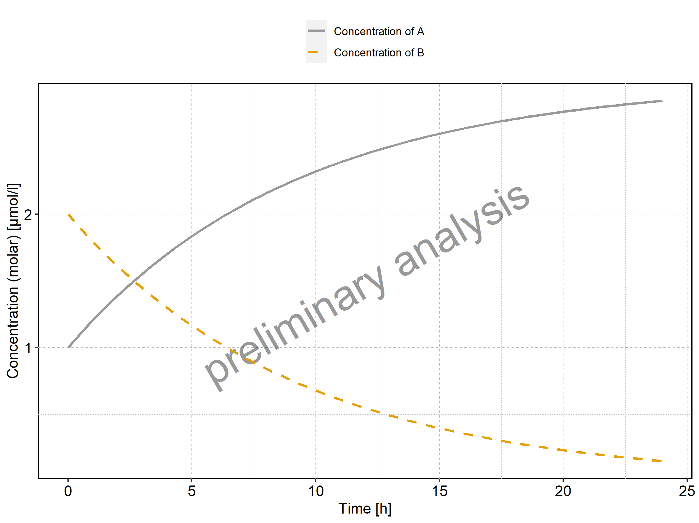
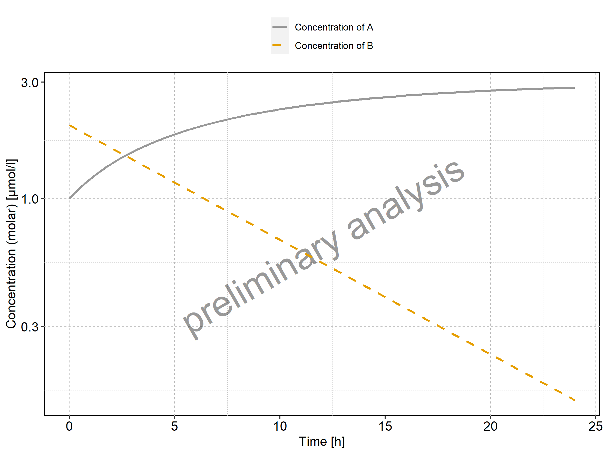

# Introduction to Reporting Engine and its instances

<div id="TOC">

  - [1 Introduction](#introduction)
      - [1.1 Nomenclature](#nomenclature)
      - [1.2 General scheme](#general-scheme)
  - [2 Workflow](#workflow)
      - [2.1 MeanModelWorkflow](#meanmodelworkflow)
      - [2.2 PopulationWorkflow](#populationworkflow)
      - [2.3 Creation of a Workflow](#creation-of-a-workflow)
  - [3 Simulation sets](#simulation-sets)
      - [3.1 Simulation file](#simulation-file)
      - [3.2 Population file](#population-file)
          - [3.2.1 Study Design file](#study-design-file)
      - [3.3 Format of data files](#format-of-data-files)
          - [3.3.1 Data file](#data-file)
          - [3.3.2 Dictionary file](#dictionary-file)
      - [3.4 Outputs](#outputs)
          - [3.4.1 Path](#path)
          - [3.4.2 Data selection](#data-selection)
          - [3.4.3 PK parameters](#pk-parameters)
  - [4 Task objects](#task-objects)
  - [5 Workflow outputs](#workflow-outputs)
      - [5.1 Logs](#logs)
      - [5.2 Result directories](#result-directories)
      - [5.3 Reports and appendices](#reports-and-appendices)

</div>

<div id="cb1" class="sourceCode">

``` sourceCode r
require(ospsuite.reportingengine)
#> Loading required package: ospsuite.reportingengine
#> Loading required package: ospsuite
#> Warning: package 'ospsuite' was built under R version 3.6.3
#> Loading required package: rClr
#> Loading the dynamic library for Microsoft .NET runtime...
#> Loaded Common Language Runtime version 4.0.30319.42000
#> Loading required package: tlf
```

</div>

This vignette introduces the notions and objects implemented in the
OSP-Suite Reporting Engine package (`ospsuite.reportingengine`).

<div id="introduction" class="section level1" data-number="1">

# 1 Introduction

The `ospsuite.reportingengine` package aims at facilitating the design
and build of reports evaluating PBPK models developed on PK-Sim or/and
Mobi.

To this end, the package benefits from the concept of R6 classes
(similar to reference classes) which allows to define structured objects
whose fields can be any object such as properties, methods or even other
R6 objects. R6 objects, or objects from R6 class, presents some
peculiarities.

  - They are created using the method `$new(...)` (e.g. `r6Object <-
    R6Class$new()`).
  - Like for objects of class list, fields of R6 objects can be called
    using either `$fieldName` or `[[fieldName]]`
    (e.g. `r6Object$method()` or `r6Object[[property]]`).
  - The R6 classes also integrate the concept of inheritance: an R6
    object will get the attributes from its class but will also inherit
    properties and methods from a parent class.

The `ospsuite.reportingengine` package is built around two central R6
classes **`MeanModelWorkflow`** and **`PopulationWorkflow`** derived
from the parent R6 class `Workflow`. The creation of `MeanModelWorkflow`
or `PopulationWorkflow` objects provides a structured environment with
methods and properties that help in designing, running and reporting the
evaluation of PBPK models developed on PK-Sim or/and Mobi. Such
structured environment works with 2 types of objects:

  - `SimulationSet` R6 objects and their `Output` R6 objects (defined in
    more details in section **3**), defining on which model(s) and/or
    data the workflow is performed. These objects need to be created
    before the creation of workflow objects as they are required by
    them.
  - `Task` R6 objects (defined in more details in section **4**),
    defining the settings of the evaluations to be performed by the
    workflow. These objects are directly included upon creation of
    `Workflow` objects. Their settings can be updated after creation.

<div id="nomenclature" class="section level2" data-number="1.1">

## 1.1 Nomenclature

Table 1 defines some of the main instances of the
`ospsuite.reportingengine` package usually defined by users during the
design of a workflow. The classes of these instances and the parent
classes they are derived from are also indicated. All these instances
derive from the `R6` class, consequently creating them requires the call
of the method `$new()` (e.g. `MeanModelWorkflow$new()`)

| Object creation                                                                                  | Object class tree                              | Definition                                                                                                  |
| :----------------------------------------------------------------------------------------------- | :--------------------------------------------- | :---------------------------------------------------------------------------------------------------------- |
| workflow \<- MeanModelWorkflow$new(simulationSets, workflowFolder)                               | R6 \> Workflow \> MeanModelWorkflow            | Object that runs tasks on simulation sets dedicated to mean models                                          |
| workflow \<- PopulationWorkflow$new(workflowType, simulationSets, workflowFolder)                | R6 \> Workflow \> PopulationWorkflow           | Object that runs tasks on simulation sets dedicated to population models                                    |
| simulationSet \<- SimulationSet$new(simulationSetName, simulationFile)                           | R6 \> SimulationSet                            | Object with information on the simulation and observation to be evaluated                                   |
| simulationSet \<- PopulationSimulationSet$new(simulationSetName, simulationFile, populationFile) | R6 \> SimulationSet \> PopulationSimulationSet | Object with information on the simulation, population and observation to be evaluated                       |
| output \<- Output$new(path)                                                                      | R6 \> Output                                   | Object with information on the simulation output path and observation to be evaluated                       |
| task \<- Task$new(settings)                                                                      | R6 \> Task                                     | Object with evaluations to be performed and saved                                                           |
| task \<- SimulationTask$new(settings)                                                            | R6 \> Task \> SimulationTask                   | Object with evaluations to be performed and saved specific to model simulations                             |
| task \<- PlotTask$new(settings)                                                                  | R6 \> Task \> PlotTask                         | Object with evaluations to be performed and saved specific to plots and tables to report                    |
| task \<- GofPlotTask$new(settings)                                                               | R6 \> Task \> PlotTask \> GofPlotTask          | Object with evaluations to be performed and saved specific to plots and tables of goodness of fit to report |
| task \<- PopulationPlotTask$new(settings)                                                        | R6 \> Task \> PlotTask \> PopulationPlotTask   | Object with evaluations across simulations to be performed and saved specific to plots and tables to report |

Table 1: Nomenclature of `ospsuite.reportingengine` main instances

</div>

<div id="general-scheme" class="section level2" data-number="1.2">

## 1.2 General scheme

A working example of workflow script is provided below for reporting a
time profile plot on *Minimodel2.pkml*.

<div id="cb2" class="sourceCode">

``` sourceCode r
# Get the pkml simulation file: "MiniModel2.pkml"
simulationFile <- system.file("extdata", "MiniModel2.pkml",
  package = "ospsuite.reportingengine"
)

# Create Output objects which define output paths that will be plotted by the workflow
outputA <- Output$new(
  path = "Organism|A|Concentration in container",
  displayName = "Concentration of A"
)
outputB <- Output$new(
  path = "Organism|B|Concentration in container",
  displayName = "Concentration of B"
)

# Create a SimulationSet object which defines the model and outputs to evaluate
myExampleSet <- SimulationSet$new(
  simulationSetName = "My example",
  simulationFile = simulationFile,
  outputs = c(outputA, outputB)
)

# Create the workflow object
myExampleWorkflow <-
  MeanModelWorkflow$new(
    simulationSets = myExampleSet,
    workflowFolder = "myExample-Results"
  )

# Set the workflow tasks to be run
myExampleWorkflow$activateTasks(c("simulate", "plotTimeProfilesAndResiduals"))

# Run the workflow
myExampleWorkflow$runWorkflow()
```

</div>

For this example, the list of files and folders generated by the
workflow are:

<div id="cb3" class="sourceCode">

``` sourceCode r
list.files(myExampleWorkflow$workflowFolder)
#> [1] "log-debug.txt"     "log-info.txt"      "Report-word.md"   
#> [4] "Report.docx"       "Report.md"         "SimulationResults"
#> [7] "TimeProfiles"
```

</div>

The associated report will be as follows:

<div class="reportOutput">

<div class="container-fluid main-container">

<div id="header" class="fluid-row">

</div>

  - [1. Time profiles and residual
    plots](#1-time-profiles-and-residual-plots)
      - [1.1. Time profiles and residual plots for My
        example](#11-time-profiles-and-residual-plots-for-my-example)

<div id="time-profiles-and-residual-plots" class="section level1">

# 1\. Time profiles and residual plots

<div id="time-profiles-and-residual-plots-for-my-example" class="section level2">

## 1.1. Time profiles and residual plots for My example

Figure 1: Time profiles of My example for MiniModel2. Time profiles are
plotted in a linear scale.



Figure 2: Time profiles of My example for MiniModel2. Time profiles are
plotted in a logarithmic scale.



</div>

</div>

</div>

</div>

</div>

</div>

<div id="workflow" class="section level1" data-number="2">

# 2 Workflow

`Workflow` objects are central in the Reporting Engine as they summarize
which evaluations are performed and how they are reported. As
illustrated in the example from section **1.1**, `Workflow` objects
manage directly 2 other R instances: `SimulationSet` and `Task` objects.
`Workflow` objects also require an output folder, `workflowFolder` to be
provided in order to be created. This folder is where all the generated
outputs will be saved and stored.

`Task` objects are R instances that correspond to the evaluations, plots
and tables to be performed, saved and/or reported (see section XXX for
more details on `Task`). Each active `Task` will be performed on a
series of `SimulationSet` objects.

`SimulationSet` objects are R objects that summarize the workflow input
parameters, they include the model(s) to be evaluated (see section **3**
for more details on `SimulationSet`). A `SimulationSet` can optionally
include observed data and a population file.

In the `ospsuite.reportingengine` package, two types of `Workflow` are
available and can be created:

1.  `MeanModelWorkflow` dedicated on evaluations specific to mean models
2.  `PopulationWorkflow` dedicated on evaluations specific to population
    models

<div id="meanmodelworkflow" class="section level2" data-number="2.1">

## 2.1 MeanModelWorkflow

The process included in `MeanModelWorkflow` can be illustrated by Figure
1.

The blue frame corresponds to the inputs of the workflow. These inputs
need to be defined through the R object `SimulationSet`. Since multiple
simulations and observed datasets can be evaluated by the workflow
tasks, it is possible to define a list of such inputs by workflow.

The black frames correspond to the tasks of the workflow. These tasks
are defined through the R object `Task`. These objects do not have to be
instantiated by the user; they are created directly by the `Workflow`
object. The user will only have to switch them on/off and update their
settings if necessary.

<div class="figure" style="text-align: center">


Figure 1: Mean model workflow inputs and tasks

</div>

</div>

<div id="populationworkflow" class="section level2" data-number="2.2">

## 2.2 PopulationWorkflow

The process included in `PopulationWorkflow` can be illustrated by
Figure 2.

The blue frame corresponds to the inputs of the workflow. These inputs
need to be defined through the R object `PopulationSimulationSet`. Since
multiple simulations, population and observed datasets can be evaluated
by the workflow tasks, it is possible to define a list of such inputs by
workflow.

The black frames correspond to the tasks of the workflow. These tasks
are defined through the R object `Task`. These objects do not have to be
instantiated by the user; they are created directly by the `Workflow`
object. The user will only have to switch them on/off and update their
settings if necessary.

In a population workflow, some tasks can compare different simulations
or population, such plots of Demography or PK parameters. There exist
different types of a population workflow

1.  **Pediatric**
      - All properties (physiology and PK Parameter) are plotted vs. age
        and weight,
      - The time profiles are plotted in comparison to a reference
        population the sensitivity analysis is done on all populations
        except the reference population
2.  **Parallel Comparison**
      - PK parameter are plotted parallel in Box-Whisker plots without a
        reference population,
      - If a reference population is given, the time profiles are
        plotted in comparison to this population
      - The sensitivity analysis is done on all populations
3.  **Ratio Comparison**
      - Same as parallel comparison, but for the PK Parameter additional
        the ratio of the PK Parameter to the reference population is
        calculated and plotted in box-whisker plots

<div class="figure" style="text-align: center">


Figure 2: Population workflow inputs and tasks

</div>

</div>

<div id="creation-of-a-workflow" class="section level2" data-number="2.3">

## 2.3 Creation of a Workflow

To create a `MeanModelWorkflow` or a `PopulationWorkflow` object, the
method `$new()` needs to be used as follow:

  - For mean model workflows:

<!-- end list -->

    myWorkflow <- MeanModelWorkflow$new(simulationSets, workflowFolder)

  - For population workflows:

<!-- end list -->

    myWorkflow <- 
    PopulationWorkflow$new(workflowType, simulationSets, workflowFolder)

where `simulationSets` is a list of `SimulationSet` objects for mean
models, and a list of `PopulationSimulationSet` objects for population
models. These objects will be further discussed in the next section.

`workflowFolder` is the name of the folder in which the workflow outputs
are saved. As illustrated in Figures 1 and 2, some tasks can use the
outputs obtained from previous tasks. If the directory specified in
`workflowFolder` contains such outputs, they will be used by the current
workflow. This latter option can be useful for updating and running only
a part of the workflow without having to perform all the simulations
every time.

The input `workflowType` is one of the 3 population workflow types
defined in section **2.2**.

</div>

</div>

<div id="simulation-sets" class="section level1" data-number="3">

# 3 Simulation sets

As workflows can evaluate multiple simulations, populations and
datasets, the creation of `MeanModelWorkflow` and `PopulationWorkflow`
requires input parameters summarized in `SimulationSet` and
`PopulationSimulationSet` objects, respectively.

Below is the syntax for creating such simulation sets, the next
sub-sections will provide more details on each input:

**Simulation Set**

    SimulationSet$new(
      simulationSetName, 
      simulationFile, 
      simulationName, 
      outputs,
      observedDataFile,
      observedMetaDataFile,
      dataReportName,
      dataSelection
    )

**Population Simulation Set**

    PopulationSimulationSet$new(
      referencePopulation,
      simulationSetName, 
      simulationFile, 
      simulationName,
      populationFile,
      populationName,
      studyDesignFile, 
      outputs, 
      observedDataFile,
      observedMetaDataFile,
      dataReportName,
      dataSelection
    )

<div id="simulation-file" class="section level2" data-number="3.1">

## 3.1 Simulation file

A simulation file, `simulationFile` is an export of a simulation from
MoBi or PK-SIM in pkml format. Display names for the simulation and the
simulation set can be provided using `simulationName` and
`simulationSetName`.

</div>

<div id="population-file" class="section level2" data-number="3.2">

## 3.2 Population file

A population file, `populationFile`, is collection of parameter paths
and parameter values normally an export of a population from PK-SIM in
csv format. It is also possible to use an M\&S activity-specific
population file, which has the “PKSIM” format, but was manipulated after
the export from PK-SIM or was generated outside of PK-Sim. The
generation of the population file than must be validated. Display names
for the population can be provided using `populationName`.

<div id="study-design-file" class="section level3" data-number="3.2.1">

### 3.2.1 Study Design file

The study design file, `studyDesignFile`, contains additional
information on the study design, e.g. a body weight dependent dose in a
pediatric study. A regular csv format is expected for such a file.

The example below shows a template of such a study design content.

| Organism|Weight | Organism|Weight | Gender         | Applications|IV Bolus|DrugMass |
| :-------------- | :-------------- | :------------- | :----------------------------- |
| kg              | kg              |                | nmol                           |
| SOURCE\_MIN     | SOURCE\_MAX     | SOURCE\_EQUALS | TARGET                         |
| 20              | 40              | MALE           | 2                              |
| 20              | 40              | FEMALE         | 2.5                            |
| 40              | 60              | MALE           | 10                             |
| 40              | 60              | FEMALE         | 14                             |
| 60              |                 |                | 20                             |

Table 2: Example of study design content

</div>

</div>

<div id="format-of-data-files" class="section level2" data-number="3.3">

## 3.3 Format of data files

**If your workflow uses data, you must provide two files**: one file
containing the data in the Nonmem format, `observedDataFile`, and a
dictionary file, `observedMetaDataFile`, which documents the content of
the data file. Display names for the data can be provided using
`dataReportName`.

<div id="data-file" class="section level3" data-number="3.3.1">

### 3.3.1 Data file

The Nonmem file can be a blank separated text file or a csv file, column
headers are used later as R variable names, and they must not contain
special letters like blanks. All data columns used for figures and
tables, must be numerical and listed in the dictionary file (details in
section **3.3.2**). For data filtering, these columns and additional
ones can be used, the additional columns may also contain strings. But
be careful that these strings do not contain the column separator blank.
A column must be either numerical or of type string, they must not
contain both.

</div>

<div id="dictionary-file" class="section level3" data-number="3.3.2">

### 3.3.2 Dictionary file

The dictionary is a csv file mapping the data file. Unlike the Matlab
version of the reporting engine, a regular csv with a comma (“,”) as
separator is expected.

The dictionary file must contain the following variables: ‘ID’, ‘type’,
‘nonmenColumn’, ‘nonmemUnit’, ‘reportName’, ‘pathID’, ‘comment’. For
time profile plots, you must provide ‘**time**’ and ‘**dv**’ in
‘**ID**’. The variable ‘**lloq**’, for lower limit of quantitation,
can also be provided but is not necessary.

The example below shows a template of a dictionary content.

| ID     | type        | nonmenColumn | nonmemUnit | reportName  | pathID          | comment                                               |
| :----- | :---------- | :----------- | :--------- | :---------- | :-------------- | :---------------------------------------------------- |
| sid    | identifier  | SID          |            |             |                 |                                                       |
| stud   | identifier  | STUD         |            |             |                 |                                                       |
| time   | timeprofile | TIME         | h          |             |                 |                                                       |
| dv     | timeprofile | DV           |            |             |                 | units are defined in corresponding output definitions |
| tad    | timeprofile | TAD          | h          |             |                 |                                                       |
| age    | covariate   | AGE          | year(s)    | Age         | Organism|Age    |                                                       |
| wght   | covariate   | WGHT         | kg         | Body weight | Organism|Weight |                                                       |
| hght   | covariate   | HGHT         | cm         | Height      | Organism|Height |                                                       |
| bmi    | covariate   | BMI          | kg/m2      | BMI         | Organism|BMI    |                                                       |
| gender | covariate   | SEX          |            | SEX         | Gender          | Make sure 1=male 2= female                            |

Table 3: Template for data dictionary

</div>

</div>

<div id="outputs" class="section level2" data-number="3.4">

## 3.4 Outputs

An `Output` object defines simulation paths and can define associated PK
parameters and observed data. Below is the syntax for creating such
`Output` objects, the next sub-sections will provide more details on
each input:

**Output**

    Output$new(
      path,
      displayName,
      displayUnit,
      dataSelection,
      dataDisplayName,
      pkParameters
    )

<div id="path" class="section level3" data-number="3.4.1">

### 3.4.1 Path

The input variable `path` indicates the path name within a simulation
(e.g. ‘*Organism|PeripheralVenousBlood|Raltegravir|Plasma (Peripheral
Venous Blood)*’) that needs to be included in the simulation run.
Display name and unit for this path can be provided using `displayName`
and `displayUnit`.

</div>

<div id="data-selection" class="section level3" data-number="3.4.2">

### 3.4.2 Data selection

For tasks such as goodness of fit, observed data can be used. Usually,
the data is included into one unique Nonmem data file which needs to be
filtered and associated to the correct `path`.

The input variable `dataSelection` provides a filter for the Nonmem data
file. It must be R readable code, using the Nonmem headers as variable
names (e.g. ‘*SID\>0*’ or ‘*AGE\<12 & SEX==1*’).

  - By default, `dataSelection` = ‘**NONE**’. Consequently, no data is
    selected and no evaluation is performed.
  - If you want to use all, you can include the filter `dataSelection` =
    ‘**ALL**’.

</div>

<div id="pk-parameters" class="section level3" data-number="3.4.3">

### 3.4.3 PK parameters

The input `pkParameters` indicates the `path` related PK parameters that
the user wants to include in his analysis. A list of pk parameter names
can be directly provided to this input (e.g. *c(‘C\_max’, ‘AUC\_inf’)*).
Display names and display units will be used as is from the PK parameter
objects defined using the `ospsuite` package.

In the case different display names or/and units are needed between the
same PK parameters but from different paths, it is also possible to use
`PkParameterInfo` instances instead of pk parameter names directly.

    PkParameterInfo$new(
      pkParameter,
      displayName, 
      displayUnit
    )

However, in the case the same display names and units are used, the
better practice is to define or update the PK parameters, their display
names and units beforehand with the `ospsuite` package, then to provide
directly the list of their names to the input `pkParameters`.

  - Updating PK parameters, their display names and units can be done
    directly with: **updatePKParameter()**.
  - Users can also create their own PK parameters using:
    **addUserDefinedPKParameter()**.

</div>

</div>

</div>

<div id="task-objects" class="section level1" data-number="4">

# 4 Task objects

As illustrated in Figures 1 and 2, workflows can perform tasks on a list
of simulation sets. Some of these tasks are not necessarily run or can
use the output results from other tasks run in previous workflows.

You can use the enums `StandardSimulationTasks` and `StandardPlotTasks`
respectively to get a quick access to standard simulation and plot tasks
common to mean model and population workflows.

When they are created, `Workflow` objects will directly include a list
of `Task` objects. To know which tasks your workflow can perform, the
workflow method **getAllTasks()** can be used. The workflow methods
**getActiveTasks()** and **getInactiveTasks()** provide the list of
active and inactive tasks of the workflow, respectively.

Using the example from section **1.1**, this gives on a mean model
workflow:

<div id="cb10" class="sourceCode">

``` sourceCode r
# All workflow's tasks
myExampleWorkflow$getAllTasks()
#> [1] "plotSensitivity"              "plotPKParameters"            
#> [3] "plotAbsorption"               "plotMassBalance"             
#> [5] "plotTimeProfilesAndResiduals" "calculateSensitivity"        
#> [7] "calculatePKParameters"        "simulate"

# Only active tasks that are run
myExampleWorkflow$getActiveTasks()
#> [1] "plotTimeProfilesAndResiduals" "simulate"

# Only inactive tasks that are not run
myExampleWorkflow$getInactiveTasks()
#> [1] "plotSensitivity"       "plotPKParameters"      "plotAbsorption"       
#> [4] "plotMassBalance"       "calculateSensitivity"  "calculatePKParameters"
```

</div>

To activate or inactivate tasks, you can use respectively the workflow
methods **activateTasks()** and **inactivateTasks()**. By default, all
the tasks will be activated or inactivated when using the method.

<div id="cb11" class="sourceCode">

``` sourceCode r
# Inactivate all tasks
myExampleWorkflow$inactivateTasks()
myExampleWorkflow$getActiveTasks()
#> NULL

# Activate only tasks "simulate" and "plotGoF" tasks
myExampleWorkflow$activateTasks(c("simulate", "plotTimeProfilesAndResiduals"))
myExampleWorkflow$getActiveTasks()
#> [1] "plotTimeProfilesAndResiduals" "simulate"
```

</div>

It is possible to modify the settings of the tasks, especially for tasks
generating figures (e.g. plot scales, inclusion of specific demography
parameters …) Task details will be provided in dedicated vignettes.

</div>

<div id="workflow-outputs" class="section level1" data-number="5">

# 5 Workflow outputs

Once the workflow and its settings have been defined, the workflow
method **$runWorkflow()** will run all the active tasks and generate all
the associated results and report. The following outputs will be
generated in `workflowFolder` directory: logs, results directories and
reports.

<div id="logs" class="section level2" data-number="5.1">

## 5.1 Logs

Three types of logs can be generated during the creation, design and run
of a workflow:

  - **log-info.txt** which contains information like starting time and
    version numbers of the used software
  - **log-error.txt** which contains all errors and warnings that
    occurred during the execution
  - **log-debug.txt** which contains information useful for debugging
    purpose.

</div>

<div id="result-directories" class="section level2" data-number="5.2">

## 5.2 Result directories

Each task will save its results in a dedicated directory. The names of
the results directory are as follow:

  - **SimulationResults** which contains the results of simulation runs,
    obtained from `simulate` task, as csv files. It is possible to load
    the results using the `ospsuite` method **importResultsFromCSV()**.
  - **PKAnalysisResults** which contains the results of PK analysis
    runs, obtained from `calculatePKParameters` task, as csv files. It
    is possible to load the results using the `ospsuite` method
    **importPKAnalysesFromCSV()**.
  - **SensitivityResults** which contains the results of sensitivity
    analysis runs, obtained from `calculateSensitivity` task, as csv
    files. It is possible to load the results using the `ospsuite`
    method **importSensitivityAnalysisResultsFromCSV()**.
  - **TimeProfiles** which contains the figures obtained from
    `plotTimeProfilesAndResiduals` task and their source values as png
    and csv files.
  - **PKAnalysis** which contains the figures and tables obtained from
    `plotPKParameters` task and their source values as png and csv
    files.
  - **Sensitivity** which contains the figures obtained from
    `plotSensitivity` task and their source values as png and csv files.
  - **MassBalance** which contains the figures and tables obtained from
    `plotMassBalance` task and their source values as png and csv files.
    This directory is specific of mean model workflows.
  - **Absorption** which contains the figures and tables obtained from
    `plotAbsorption` task and their source values as png and csv files.
    This directory is specific of mean model workflows.
  - **Demography** which contains the figures and tables obtained from
    `plotDemography` task and their source values as png and csv files.
    This directory is specific of population model workflows.

Default figure format is png, but it is possible to change this default
using **setPlotFormat()**.

</div>

<div id="reports-and-appendices" class="section level2" data-number="5.3">

## 5.3 Reports and appendices

Each plot task will save an appendix file besides its results as a
markdown format report. These appendices are saved directly within the
`workflowFolder` directory results directory with the following names:

  - **appendix-time-profile.md** from `plotTimeProfilesAndResiduals`
    task.
  - **appendix-pk-parameters.md** from `plotPKParameters` task.
  - **appendix-sensitivity-analysis.md** from `plotSensitivity` task.
  - **appendix-mass-balance.md** from `plotMassBalance` task.
  - **appendix-absorption.md** from `plotAbsorption` task.
  - **appendix-demography.md** from `plotDemography` task.

At the end of the workflow run, all the available appendices are
combined into final reports:

  - **Report.md** which contains the markdown version of the report,
    including a table of content and numbering the figures and tables.
  - **Report-word.md** which contains a markdown version of the report
    to be translated by *pandoc* for generating the word report.
  - **Report.docx** which contains the word version of the report,
    including a table of content and numbering the figures and tables.

The option `createWordReport` is set to **TRUE** as default but can be
set to **FALSE** to prevent the conversion of **Report-word.md** into
**Report.docx** using *pandoc* .

</div>

</div>
