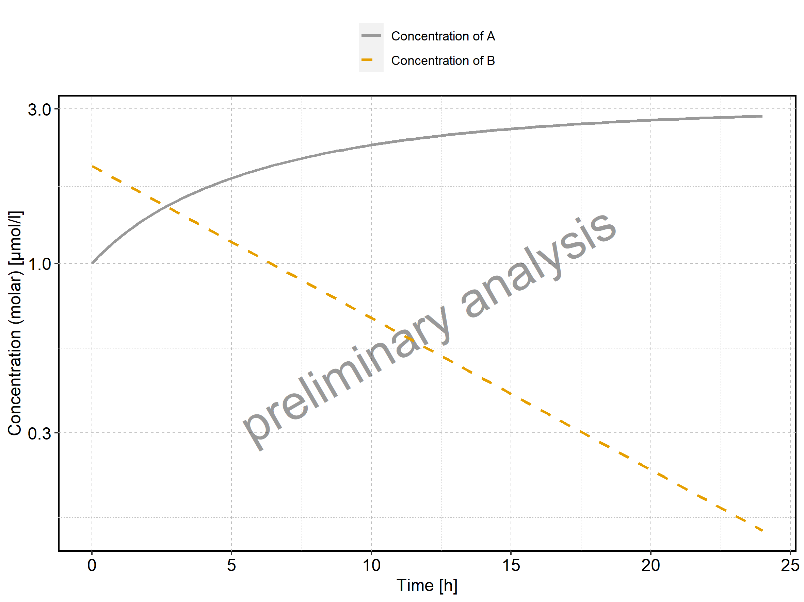

The associated report will be as follows:

  - [1. Time profiles and residual
    plots](#1-time-profiles-and-residual-plots)
      - [1.1. Time profiles and residual plots for My
        example](#11-time-profiles-and-residual-plots-for-my-example)

# 1\. Time profiles and residual plots

## 1.1. Time profiles and residual plots for My example

Figure 1: Time profiles of My example for MiniModel2. Time profiles are
plotted in a linear scale.

Figure 2: Time profiles of My example for MiniModel2. Time profiles are
plotted in a logarithmic scale.

